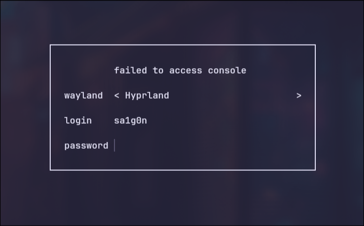

# SA1G0N - Gentoo Ebuild Repository

Welcome to the SA1G0N Gentoo ebuild repository! This repository is dedicated to updating and maintaining ebuilds for packages that I use. 
Ebuilds contained in this repository are tested and then sent to Gentoo's GURU development branch.



## Repository Contents

### Current Packages

- **ly**: A lightweight and fast display manager with a focus on simplicity and performance. (In GURU now)
- **auto-cpufreq**: Automatic CPU speed & power optimizer for Linux (In GURU now)
- **system76-profile**: Tools and configurations for optimizing System76 hardware on Gentoo, including power management and performance tweaks. (In GURU now)
- **auto-cpufreq**: A tool for automatic CPU battery optimization (In GURU now)
- **Zen**: A Firefox-based privacy oriented browser with a wide range of customizations (Not in GURU yet)

### Planned Additions

- **asusctl**: A utility to control various settings on Asus laptops, including fan speeds, RGB lighting, and power profiles.
- **Ladybird**: A new browser from scratch in development

## Why This Repository?

Gentoo is a fantastic distribution for those who love customization and performance. However, some ebuilds can become outdated or unmaintained over time. This repository aims to bridge that gap by providing updated ebuilds for essential packages that enhance your Gentoo experience.

## How to Use

1. **Clone the Repository:**

   ```sh
   git clone https://github.com/S41G0N/SA1G0N.git
   ```

2. **Navigate to the Repository Directory:**

   ```sh
   cd SA1G0N
   ```

3. **Add the Repository to Your Local Gentoo Configuration:**

   Add the following to your `/etc/portage/repos/repos.conf`:

   ```ini
   [sa1g0n]
   location = /path/to/SA1G0N
   sync-type = git
   sync-uri = https://github.com/S41G0N/SA1G0N.git
   ```

4. **Sync the Repository:**

   ```sh
   emaint sync -r SA1G0N
   ```

5. **Install the Packages:**

   ```sh
   emerge --ask zen-bin
   ```

## Contributing

Contributions are welcome! If you have an ebuild that you'd like to see maintained or updated, feel free to open an issue or submit a pull request. Here are a few ways you can contribute:

- **Report Bugs:** Found a bug? Let us know by opening an issue.
- **Submit Ebuilds:** Have an ebuild you want to share? Submit a pull request.
- **Suggest Enhancements:** Got an idea for improving the repository? We’d love to hear from you.

## Contact

If you have any questions or need assistance, feel free to reach out:

- **Email:** saigon-tech@tuta.io
- **GitHub Issues:** [Open an Issue](https://github.com/S41G0N/SA1G0N/issues)

## License

This repository is licensed under the MIT License. See the [LICENSE](LICENSE) file for more details.

---

By following these steps, you can ensure that your Gentoo system remains cutting-edge with the latest software enhancements and optimizations. Happy hacking!

---

Feel free to customize the contact information and any other specific details to better match your repository and personal preferences.
